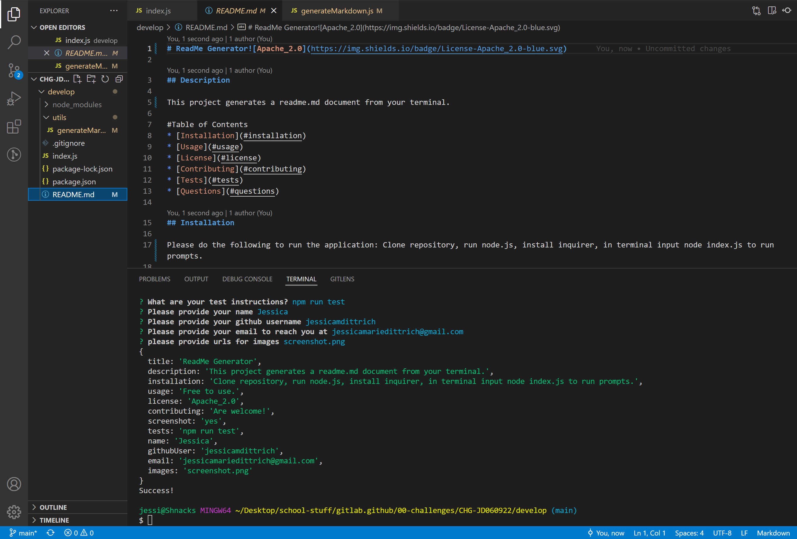

# ReadMe Generator 

## Description

This project generates a readme.md document from your terminal

# Table of Contents
* [Installation](#installation)
* [Usage](#usage)
* [License](#license)
* [Contributing](#contributing)
* [Tests](#tests)
* [Questions](#questions)

## Installation

Please do the following to run the application: Clone repository, run node.js, install inquirer, in terminal input node index.js to run prompts.

## Usage

In order to use this app: Free to use.
## License

This project is licensed under the Apache_2.0 license.
## Contributing
Contributors: Are welcome!

## Tests

The following is needed to run the test: npm run test

## Questions

If you have any questions or issues with the application, please reach out to Jessica with the information provided below:
[Link to GitHub](https://github.com/jessicamdittrich)
jessicamariedittrich@gmail.com

